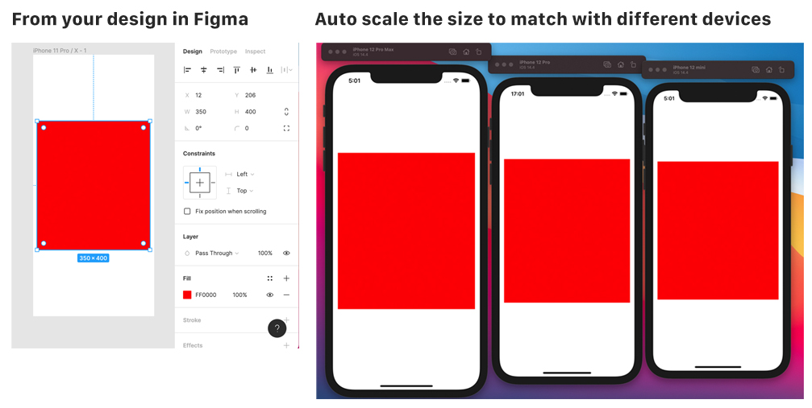

# react-native-figma-scale

a react-native library to automatically scaling based on your design in Figma



## Installation

```sh
npm install react-native-figma-scale
```

## Usage

```js
import * as React from 'react';

import { View } from 'react-native';
import { ScaleProvider, swidth, sheight } from 'react-native-figma-scale';

export default function App() {
  // define width, height in ScaleProvider (width and height from your Figma design)
  return (
    <ScaleProvider width={375} height={812}>
      <AppForTest />
    </ScaleProvider>
  );
}

const AppForTest = () => {
  // use swidth, sheight to translate your figma sizes into device sizes
  return (
    <View style={{ flex: 1, justifyContent: 'center', alignItems: 'center' }}>
      <View
        style={{
          width: swidth(350),
          height: sheight(400),
          backgroundColor: 'red',
          justifyContent: 'center',
          alignItems: 'center',
        }}
      ></View>
    </View>
  );
};
```

## Contributing

See the [contributing guide](CONTRIBUTING.md) to learn how to contribute to the repository and the development workflow.

## License

MIT
